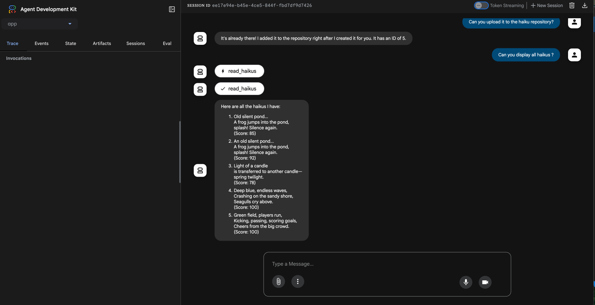

# Haiku Demo with ADK, A2A, and MCP


This project contains a multi-component system for generating, validating, and storing haikus. It is a "Hello World" example for building with the Google Agent Development Kit (ADK), the A2A framework, and an MCP server.

## Project Components

This repository is a monorepo containing the following services:

*   **`haiku-app/`**: The primary interface build with the ADK, generated by using the [Agent Start Pack](https://googlecloudplatform.github.io/agent-starter-pack/). It invokes the A2A validator and MCP Haiku Store. For more information, see the [`haiku-app/README.md`](haiku-app/README.md).
*   **`a2a_validator/`**: A haiku validation service. This agent exposes an Agent-to-Agent (A2A) endpoint that the `haiku-app` can call to validate the structure of a haiku. For more information, see the [`a2a_validator/README.md`](a2a_validator/README.md).
*   **`mcp-haiku-store/`**: A service for storing and retrieving haikus, using SQLitea and FastMCP to expose a REST-like API for haiku management. For more information, see the [`mcp-haiku-store/README.md`](mcp-haiku-store/README.md).

## System Overview



The `haiku-app` is the entry point for user interaction. The `haiku-app` will ask a user for a topic to generate a haiku about. Once generated, the user is free to either:

1.  Call the `a2a_validator` service to ensure the generated text is a valid haiku and give it a rating
2.  Store the validated haiku using the `mcp-haiku-store` service, and also retrieve and delete existing haikus
3.  Invoke a simple tool to capitalize the haiku, as an example tool function

## Getting Started

### Prerequisites

- Python 3.10+
- [Google Cloud SDK](https://cloud.google.com/sdk/docs/install) 
- [uv](https://docs.astral.sh/uv/getting-started/installation/) (Optional, Python package management) 

Google cloud services to enable: 
```bash
gcloud services enable cloudresourcemanager.googleapis.com \
                       servicenetworking.googleapis.com \
                       run.googleapis.com \
                       cloudbuild.googleapis.com \
                       artifactregistry.googleapis.com \
                       aiplatform.googleapis.com \
                       compute.googleapis.com
```

To run the complete system, you'll need to run each of the three services in a separate terminal.

1.  **Run the `haiku-app`**
    - Navigate to the `haiku-app` directory:
      ```bash
      cd haiku-app
      ```
    - Install dependencies:
      ```bash
      make install
      ```
    - Run the application:
      ```bash
      make playground
      ```
    - This will give you the base haiku generator. Optionally, you can go to the agent.py file and uncomment out the `haiku_validator_agent` and `MCPToolset` lines and follow the below instructions to leverage the A2A validator and MCP Haiku Store.


2.  **Run the `a2a_validator`**
    - Navigate to the `a2a_validator` directory:
      ```bash
      cd a2a_validator
      ```
    - Create a virtual environment and install requirements:
      ```bash
      uv venv
      source .venv/bin/activate
      uv pip install -r requirements.txt
      ```
    - Create a `.env` file by copying the `.sample-env` and filling out the correct values.
    - Run the A2A agent:
      ```bash
      uvicorn agent:a2a_app --host localhost --port 8001
      ```
    - Take the localhost URL and port number and add it to your `.env` file as the `HAIKU_VALIDATOR_AGENT_URL` variable.
    - Restart the `haiku-app` with `make playground`
    - Cloud Run deployment info at [`a2a_validator/README.md`](a2a_validator/README.md)


3.  **Run the `mcp-haiku-store`**
    - Navigate to the `mcp-haiku-store` directory:
      ```bash
      cd mcp-haiku-store
      ```
    - Run the MCP server:
      ```bash
      uv run server.py
      ```
    - Take the localhost URL and port number and add it to your `.env` file as the `MCP_HAIKU_STORE_SERVER_URL` variable.
    - Restart the `haiku-app` with `make playground`
    - Cloud Run deployment info at [`mcp-haiku-store/README.md`](mcp-haiku-store/README.md)


