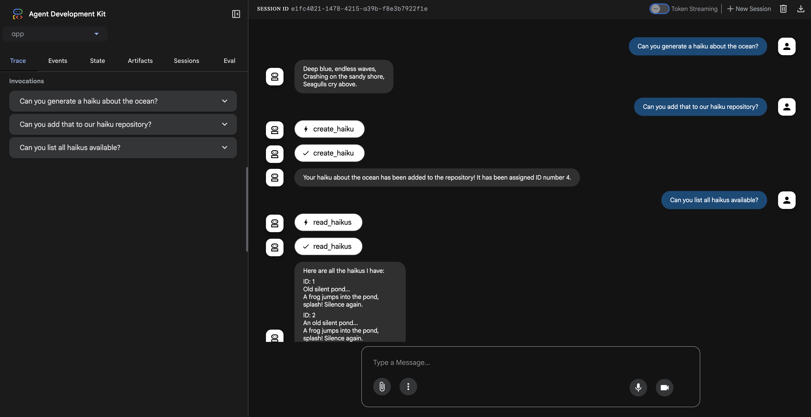

# Haikus with ADK and A2A

This project contains a multi-component system for generating, validating, and transforming haikus. It is a "Hello World" example for building with Google's Agent Development Kit (ADK) and the Agent2Agent (A2A) framework.

## Project Components

This repository is a monorepo containing the following services:

*   **`haiku-app/`**: The primary interface build with the ADK, generated by using the [Agent Start Pack](https://googlecloudplatform.github.io/agent-starter-pack/). It invokes the A2A validator and A2A Utilities agent. For more information, see the [`haiku-app/README.md`](haiku-app/README.md).
*   **`a2a_validator/`**: A haiku validation service. This agent exposes an Agent-to-Agent (A2A) endpoint that the `haiku-app` can call to validate the structure of a haiku. For more information, see the [`a2a_validator/README.md`](a2a_validator/README.md).
*   **`a2a_utilities/`**: A haiku utility service. This agent exposes an Agent-to-Agent (A2A) endpoint that the `haiku-app` can call to transform the text of a haiku. For more information, see the [`a2a_utilities/README.md`](a2a_utilities/README.md).


## System Overview



The `haiku-app` is the entry point for user interaction. The `haiku-app` will ask a user for a topic to generate a haiku about. Once generated, the user is free to either:

1.  Call the `a2a_validator` service to ensure the generated text is a valid haiku and give it a rating
2.  Call the `a2a_utilities` service to make the haiku uppercase, lowercase, or invoke other functions to transform the text.

## Getting Started

### Prerequisites

- Python 3.10+
- [Google Cloud SDK](https://cloud.google.com/sdk/docs/install)
- `make`
    - The build automation tool to run a `Makefile`
- [uv](https://docs.astral.sh/uv/getting-started/installation/)
    - Python package management system
    - More tightly coupled with ADK libraries and offers quicker development than `pip` alone

Prerequisite commands to setup the Google Cloud project:
```bash
# Authenticate with gcloud CLI
gcloud auth login

# Authenticate for local development code (ADC)
gcloud auth application-default login

# Create a new Google Cloud project
gcloud projects create PROJECT_ID

# Set your project
export PROJECT_ID=<YOUR_PROJECT_ID>
gcloud config set project $PROJECT_ID

# Enable necessary services
gcloud services enable cloudresourcemanager.googleapis.com \
                       servicenetworking.googleapis.com \
                       run.googleapis.com \
                       cloudbuild.googleapis.com \
                       artifactregistry.googleapis.com \
                       aiplatform.googleapis.com \
                       compute.googleapis.com 
```

To run the complete system, you'll need to run each of the three services in a separate terminal.

1.  **Run the `haiku-app`**
    - Navigate to the `haiku-app` directory:
      ```bash
      cd haiku-app
      ```
    - Install dependencies:
      ```bash
      make install
      ```
    - Run the application:
      ```bash
      make playground
      ```
    - This will give you the base haiku generator. Optionally, you can go to the `agent.py` file and uncomment out the `validator_agent` and `utilities_a2a_agent` lines and follow the below instructions to leverage the A2A validator and utility agents.
    - Cloud Run deployment info at [`haiku-app/README.md`](haiku-app/README.md)


2.  **Run the `a2a_validator`**
    - Navigate to the `a2a_validator` directory:
      ```bash
      cd a2a_validator
      ```
    - Create a virtual environment and install requirements:
      ```bash
      uv venv
      source .venv/bin/activate
      uv pip install -r requirements.txt
      ```
    - Create a `.env` file by copying the `.sample-env` and filling out the correct values.
    - Run the A2A agent:
      ```bash
      uvicorn agent:a2a_app --host localhost --port 8001
      ```
    - Take the localhost URL and port number and add it to your `.env` file as the `HAIKU_VALIDATOR_AGENT_URL` variable.
    - Make sure `validator_agent` is uncommented in [`haiku-app/agent.py`](haiku-app/agent.py`)
    - Restart the `haiku-app` with `make playground`
    - Cloud Run deployment info at [`a2a_validator/README.md`](a2a_validator/README.md)


3.  **Run the `a2a_utilities`**
    - Navigate to the `a2a_utilities` directory:
      ```bash
      cd a2a_utilities
      ```
    - Create a virtual environment and install requirements:
      ```bash
      uv venv
      source .venv/bin/activate
      uv pip install -r requirements.txt
      ```
    - Create a `.env` file by copying the `.sample-env` and filling out the correct values.
    - Run the A2A agent:
      ```bash
      uvicorn agent:a2a_app --host localhost --port 8002
      ```
    - Take the localhost URL and port number and add it to your `.env` file as the `HAIKU_UTILITIES_AGENT_URL` variable.
    - Make sure `utilities_a2a_agent` is uncommented in [`haiku-app/agent.py`](haiku-app/agent.py`)
    - Restart the `haiku-app` with `make playground`
    - Cloud Run deployment info at [`a2a_utilities/README.md`](a2a_utilities/README.md)


